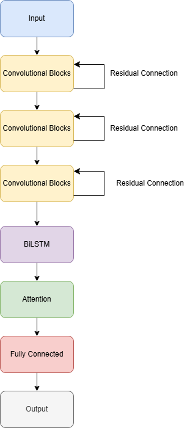

# Network Intrusion Detection System using Deep Learning

This project implements an AI-based Network Intrusion Detection System (NIDS) using deep learning models trained on the CICIDS2017 dataset. It combines Exploratory Data Analysis (EDA), advanced preprocessing techniques, and a hybrid CNN-BiLSTM model with attention to detect various types of cyberattacks such as DDoS, DoS, Brute Force, Port Scanning, Bots, and Web Attacks.





## Table of Contents
- [Project Overview](#project-overview)
- [Dataset](#dataset)
- [Technologies Used](#technologies-used)
- [Project Structure](#project-structure)
- [Installation](#installation)
- [Execution Steps](#execution-steps)
- [Model Summary](#model-summary)
- [Results](#results)
- [References](#references)

## Project Overview

Traditional NIDS rely on static, signature-based detection techniques which are ineffective against evolving threats. This project addresses those limitations by using deep learning to dynamically analyze network traffic and detect known and unknown attacks with high accuracy.

The proposed system:
- Performs EDA to understand traffic patterns.
- Uses undersampling, SMOTE, and class weighting to address class imbalance.
- Implements a hybrid CNN + BiLSTM model with attention for classification.
- Evaluates models using metrics like accuracy, precision, recall, F1-score, ROC, and PR curves.

## Dataset

- **Name:** CICIDS2017
- **Source:** Canadian Institute for Cybersecurity (UNB)
- **Size:** 2.5 million rows with 53 features
- **Classes:** Normal, DDoS, DoS, Port Scan, Brute Force, Web Attack, Bots

## Technologies Used

- Python
- Google Colab
- NumPy, Pandas
- Matplotlib, Seaborn
- Scikit-learn
- Imbalanced-learn (SMOTE)
- TensorFlow / Keras
- XGBoost

## Project Structure

```
├── AI_Project_EDA.ipynb           # Data analysis and visualization
├── NIDS_AI_CA3.ipynb              # Model training and evaluation
├── README.md                      # Project documentation
├── AI Report.pdf                  # Final report
├── cicids2017_cleaned.csv         # Dataset (mounted via Google Drive)
```

## Installation

1. Clone the repository or upload the notebook to Google Colab.
2. Ensure the dataset `cicids2017_cleaned.csv` is available on your Google Drive.
3. Install required packages (if not already installed):

```bash
pip install pandas numpy matplotlib seaborn scikit-learn imbalanced-learn xgboost
```

4. If using Colab, mount Google Drive:

```python
from google.colab import drive
drive.mount('/content/drive')
```

## Execution Steps

1. **Data Loading and Cleaning**:
   - Load CICIDS2017 cleaned dataset from Google Drive.
   - Perform univariate, bivariate, and multivariate EDA.

2. **Data Preprocessing**:
   - Use `RandomUnderSampler` to balance the majority class.
   - Apply SMOTE for minority class oversampling.
   - Encode labels and normalize features.

3. **Model Implementation**:
   - Train and evaluate the following models:
     - Random Forest
     - XGBoost
     - CNN
     - CNN + BiLSTM + Attention (final model)

4. **Model Evaluation**:
   - Use accuracy, precision, recall, F1-score, loss curves, and ROC/PR curves for analysis.
   - Visualize results and performance metrics.

## Model Summary

The final hybrid model combines:
- 3 x 1D Convolutional blocks with residual connections
- 2-layer Bidirectional LSTM
- Attention layer
- Fully connected output for classification

This architecture captures both spatial and temporal patterns effectively in the network traffic data.

## Results

| Model          | Accuracy |
|----------------|----------|
| Random Forest  | 0.96     |
| XGBoost        | 0.95     |
| CNN            | 0.93     |
| CNN+BiLSTM     | **0.97** |

- ROC AUC: 1.00 for most classes
- High performance across all classes except minor drops in Bots and Web Attacks

## References

All cited papers and datasets are listed in detail in the final report (`AI Report.pdf`) using IEEE referencing format.
